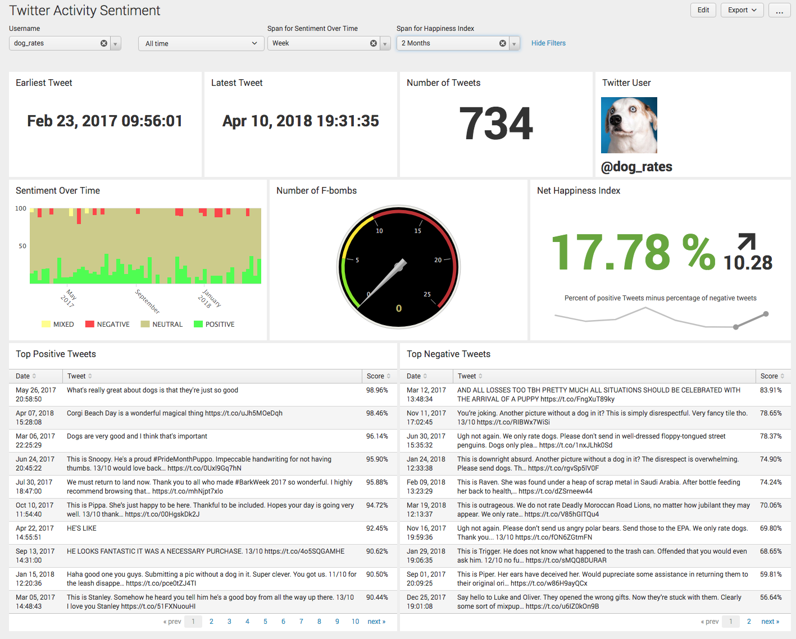

# Twitter AWS Comprehend

I recently learned of <a href="https://aws.amazon.com/comprehend/">Amazon Comprehend</a> and wanted
to play around with its sentiment analysis.

So I built this app to download user timelines from Twitter, send them to AWS for analysis, and visualize them in Splunk.  The following metrics are reported:

- Start and end dates for tweets
- Number of tweets
- A graph of "Sentiment Over Time"
- Number of F-bombs used
- Net Happiness Index (percent of happy tweets minus precent of unhappy tweets)
- Top Positive and Negative tweets

## Requirements

- Python 3
- Run the command `pip install -r requirements.txt` to download all required packages
- A Twitter app created at <a href="https://apps.twitter.com/">https://apps.twitter.com/</a>.  Read-only access is fine.
- A running Splunk Instance.  A free copy of Splunk can be downlaoded from <a href="https://www.splunk.com/">Splunk.com</a>.

## Getting started

### Downloading Tweets

You'll want to start off by running the script **./0-fetch-tweets.py -u username -n num_tweets_to_download** to download Tweets via Twitter's API.
When you first run the script, it will notice the lack of credentials and send you over to Twitter's App page,
where you'll need to create an app.  Then grab the App Key and App Secret and enter them when the script prompts you.
Next, you'll be sent over to Twitter one more time and will receive a PIN to enter in the script.  Do so,
and you'll be authenticated to Twitter.  **This is a one-time process**, so once you do it, you should not need
to do it again.

The maximum number of tweets you can download from Twitter's API is **3200**, but the actual number you get will
be much lower as RTs are ignored and Twitter's API is really weird about giving you the actual number of tweets that you ask for.  I do not understand it.

### Analyizing Tweets

WARNING: **This costs money!**  Based on <a href="https://aws.amazon.com/comprehend/pricing/">AWS's pricing structure</a>, a tweet will be treated as 3 "units", which will cost you $.0003, or 3 hundredths of a cent to analyze.  So 100 tweets will cost 3 cents, while 1,000 tweets will cost 30 cents.

The syntax for the script to analyize sentment is **1-analyze-sentiment -u username -n num_tweets [ --fake ]**

I strongly encourage you to run the script with **--fake** on the first few tries so that you can fake calls to AWS and get comfortable running the script.

### Feeding the analyzed tweets to Splunk

The syntax for the script to feed the tweets into Splunk is: **2-ingest-into-splunk -u username [ --splunk-port port ] [ --splunk-host hostname ]**  Defaults are 9997 and localhost, respectively.

The data is sent to Splunk over a raw TCP connection, so you'll want to configure Splunk accordingly.  Here's a screenshot to help with that:

You'll want to have this source saving to the **main** Index.

## Visualization 

This is the most interesting part.  So far, we are making the following assumptions about Splunk:
- Use of the **main** Index
- Use of the Sourcetype **twitter**
- Use of the Splunk app **Search**

Assuming those are the case, you're good to go!  Just copy the file **splunk/twitter_activity_sentiment.xml** into **$SPLUNK_HOME/etc/apps/search/local/data/ui/views**, restart Splunk, and you should be all set!  

Alternatively, a less convoluted way (which does not require restarting Splunk) would be to create a new dashboard, click **Edit**, click **Source**, and paste in the contents of **twitter_activity_sentiment.xml**.

